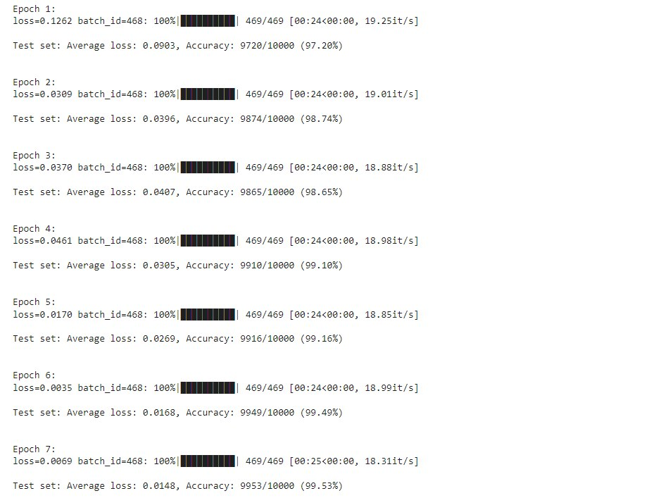

# MNIST CNN Model Architecture

This repository contains a CNN model implementation for the MNIST dataset using PyTorch. The model is designed with specific architectural constraints and requirements.


### Model Requirements

The model must satisfy the following requirements:

1. **Parameter Count**: < 20,000 parameters
2. **Regularization**: 
   - Must use Batch Normalization
   - Must implement Dropout
3. **Architecture**:
   - Must use either Global Average Pooling or Fully Connected Layer
   - Conv2d layers must be followed by BatchNorm2d

## Training Configuration

### Data Augmentation
- Rotation: ±5 degrees
- Translation: ±10%
- Scaling: 90-110%

### Optimizer Settings
- Algorithm: SGD with momentum
- Learning rate: 0.01
- Momentum: 0.9
- Weight decay: 1e-4

### Learning Rate Scheduler
- Type: OneCycleLR
- Max LR: 0.5
- Epochs: 7
- Division factors: 
  - Initial: 5.0
  - Final: 1e4

## How to Use

1. **Setup Environment**

```
pip install -r requirements.txt
```

2. **Run Training**

```
python MNIST_CNN.py
```
3. **Run Tests**

```
pytest test_model_architecture.py
```

## Automated Testing

This repository uses GitHub Actions for automated testing. The workflow:
- Checks model architecture requirements
- Verifies parameter count
- Ensures proper use of BatchNorm and Dropout
- Validates layer sequencing
- Generates test reports

### Test Results


## License
MIT

---
## GitHub Actions Varios Test Results: 


## Model Architecture Tests

The model architecture is automatically tested for the following requirements:

1. **Parameter Count**: Ensures the model has less than 20,000 trainable parameters
2. **Batch Normalization**: Verifies the use of Batch Normalization layers
3. **Dropout**: Confirms the presence of Dropout layers for regularization
4. **Output Layer**: Checks for either Global Average Pooling or Fully Connected layer

To run the tests locally:

```
pytest test_model_architecture.py -v
```


